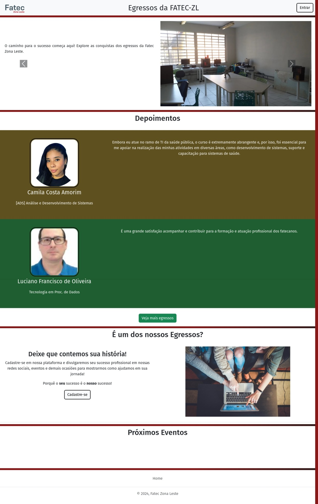
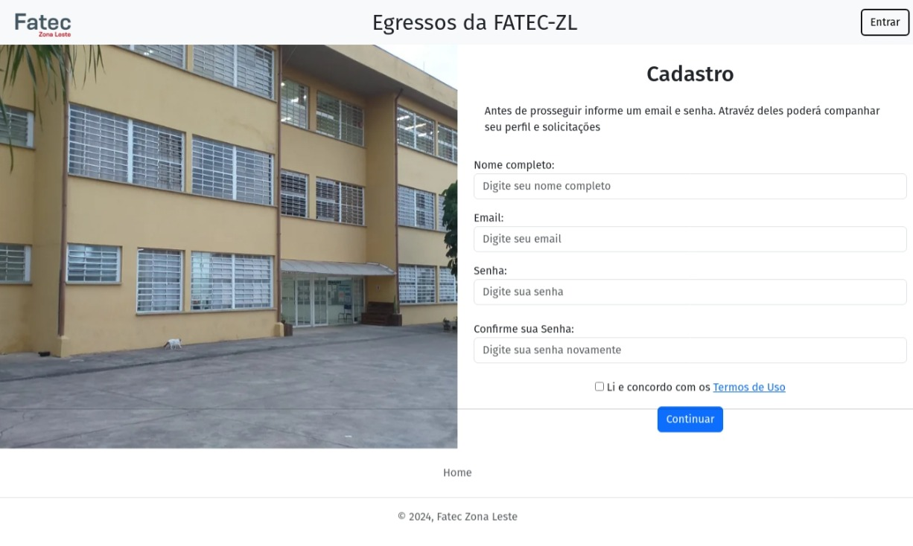
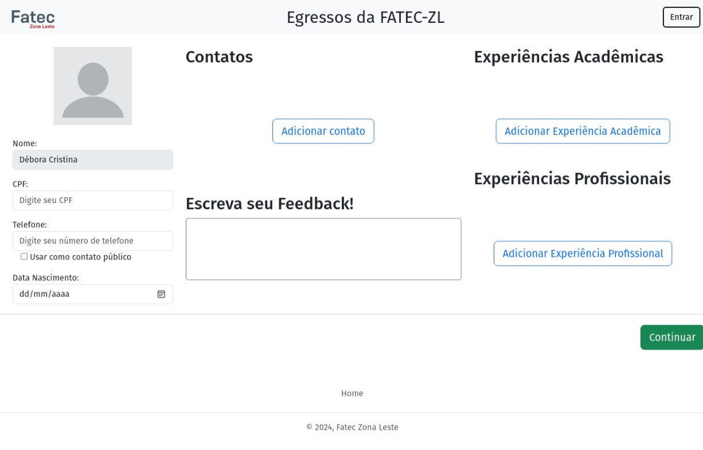
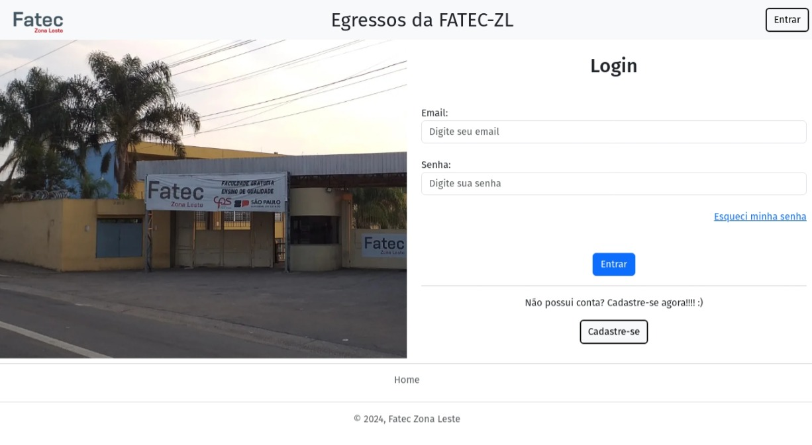
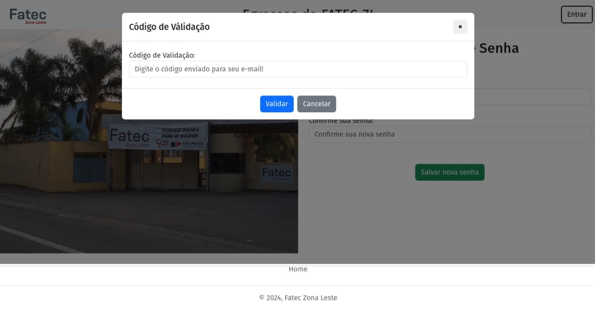
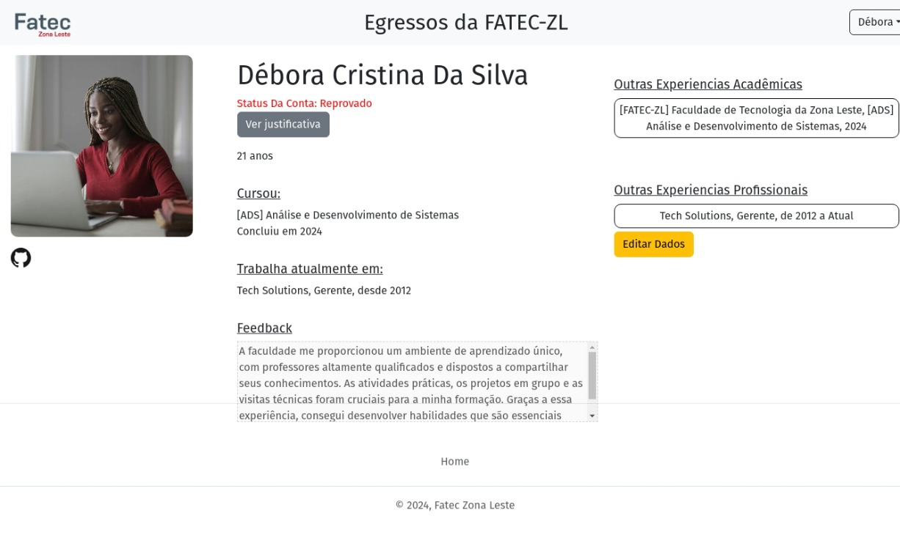
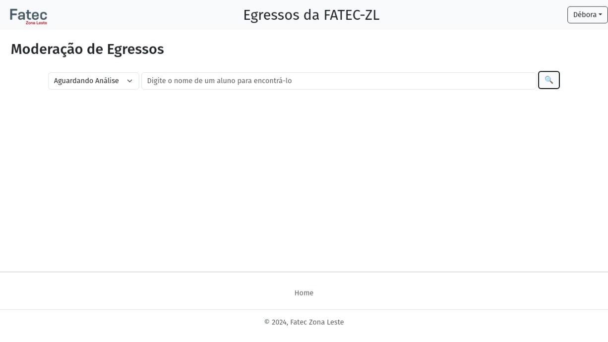

# **Plataforma de Egressos - FATEC Zona Leste**  

Este projeto é uma plataforma web desenvolvida para conectar ex-alunos da **Faculdade de Tecnologia da Zona Leste (FATEC-ZL)**. O sistema permite que egressos se cadastrem, visualizem perfis de outros ex-alunos e compartilhem suas experiências.  

🔗 **Acesse o site:** [fateczl.app.br](https://fateczl.app.br/)  

## 🚀 **Tecnologias Utilizadas**  
- **Laravel** – Framework PHP para desenvolvimento backend  
- **PHP** – Linguagem de programação para a lógica do servidor  
- **HTML, CSS, JavaScript** – Tecnologias para a estrutura, o estilo e a interatividade da interface  
- **MySQL** – Banco de dados para armazenamento das informações dos usuários  
- **HOSTINGER** – Plataforma host

## 📌 **Funcionalidades**  
- 📍 **Página principal** – Apresentação do sistema  
- 📝 **Cadastro** – Formulário para novos egressos se registrarem  
- 🔑 **Login** – Autenticação de usuários  
- 🔄 **Recuperação de Senha** – Opção para redefinir a senha via e-mail  
- 👤 **Perfil do Usuário** – Página onde os egressos podem visualizar e editar suas informações  
- 🛠️ **Painel Administrativo** – Área para gestão dos usuários e da plataforma  

## 🖼️ **Capturas de Tela**  

  
  
  
  
  
  
  

## 📄 **Licença**  
Este projeto está sob a licença MIT.  
